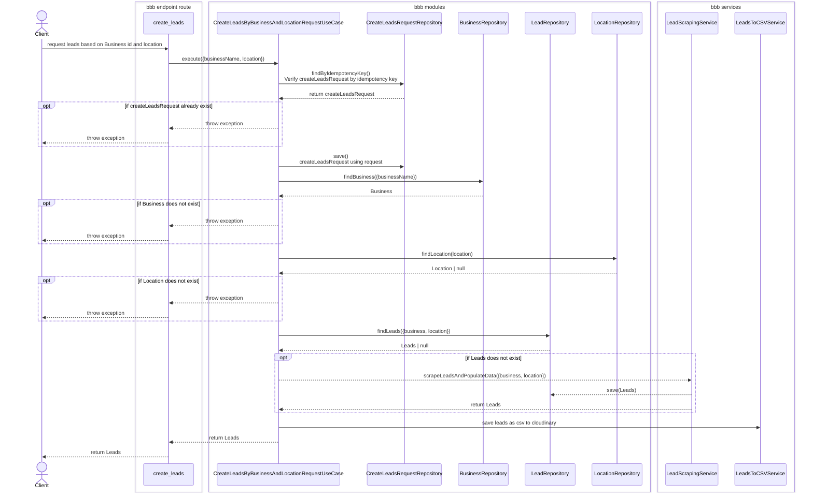

### Get Leads Workflow

```mermaid
sequenceDiagram
    actor Client

    box bbb endpoint route
        participant create_leads
    end

    box bbb modules
        participant CreateLeadsByBusinessAndLocationRequestUseCase
        participant CreateLeadsRequestRepository
        participant BusinessRepository
        participant LeadRepository
        participant LocationRepository
    end

    box bbb services
        participant LeadScrapingService
        participant LeadsToCSVService
    end

    Client->>create_leads: request leads based on Business id and location

    create_leads->>CreateLeadsByBusinessAndLocationRequestUseCase: execute({businessName, location})

    CreateLeadsByBusinessAndLocationRequestUseCase->>CreateLeadsRequestRepository: findByIdempotencyKey()<br />Verify createLeadsRequest by idempotency key
    CreateLeadsRequestRepository-->>CreateLeadsByBusinessAndLocationRequestUseCase: return createLeadsRequest
        opt if createLeadsRequest already exist
            CreateLeadsByBusinessAndLocationRequestUseCase-->>create_leads: throw exception
            create_leads-->>Client: throw exception
        end
    CreateLeadsByBusinessAndLocationRequestUseCase->>CreateLeadsRequestRepository: save()<br />createLeadsRequest using request

    CreateLeadsByBusinessAndLocationRequestUseCase->>BusinessRepository: findBusiness({businessName})
    BusinessRepository-->>CreateLeadsByBusinessAndLocationRequestUseCase: Business
        opt if Business does not exist
            CreateLeadsByBusinessAndLocationRequestUseCase-->>create_leads: throw exception
            create_leads-->>Client: throw exception
        end

    CreateLeadsByBusinessAndLocationRequestUseCase->>LocationRepository: findLocation(location)
    LocationRepository-->>CreateLeadsByBusinessAndLocationRequestUseCase: Location | null
        opt if Location does not exist
            CreateLeadsByBusinessAndLocationRequestUseCase-->>create_leads: throw exception
            create_leads-->>Client: throw exception
        end

    CreateLeadsByBusinessAndLocationRequestUseCase->>LeadRepository: findLeads({business, location})
    LeadRepository-->>CreateLeadsByBusinessAndLocationRequestUseCase: Leads | null
        opt if Leads does not exist
            CreateLeadsByBusinessAndLocationRequestUseCase-->>LeadScrapingService: scrapeLeadsAndPopulateData({business, location})
            LeadScrapingService-->>LeadRepository: save(Leads)
            LeadScrapingService-->>CreateLeadsByBusinessAndLocationRequestUseCase: return Leads
        end

    CreateLeadsByBusinessAndLocationRequestUseCase->>LeadsToCSVService: save leads as csv to cloudinary

    CreateLeadsByBusinessAndLocationRequestUseCase-->>create_leads: return Leads
    create_leads-->>Client: return Leads
```